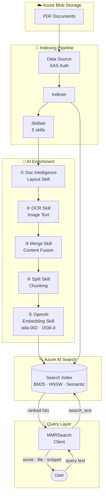
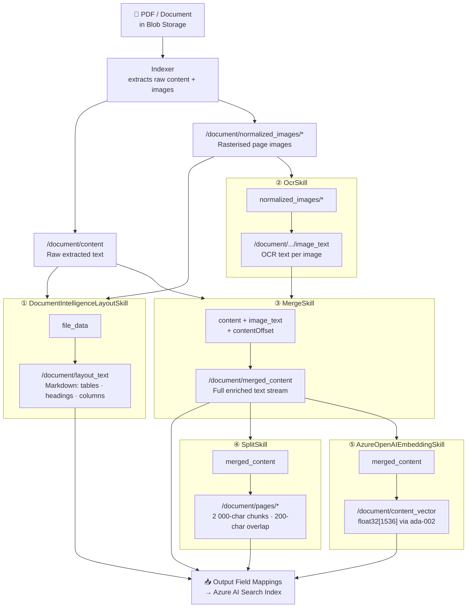
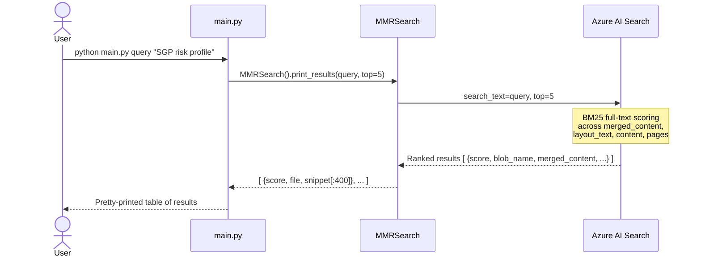
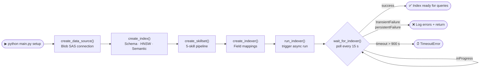
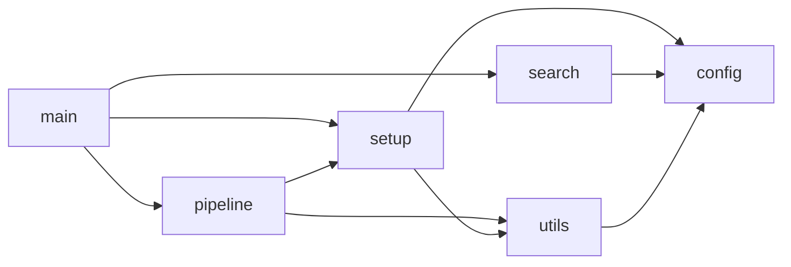

# Azure Multimodal RAG Pipeline

A production-ready **Retrieval-Augmented Generation (RAG)** pipeline on Azure. Indexes PDF documents from Azure Blob Storage by extracting layout structure, tables, embedded image text (OCR), and dense vector embeddings — enabling full-text, vector, and semantic hybrid search via Azure AI Search.

---

## Table of Contents

1. [Architecture Overview](#architecture-overview)
2. [Indexing Pipeline](#indexing-pipeline)
3. [Query Flow](#query-flow)
4. [Setup / Provisioning Flow](#setup--provisioning-flow)
5. [Module Structure](#module-structure)
6. [Index Schema](#index-schema)
7. [Environment Variables](#environment-variables)
8. [Usage](#usage)
9. [Skill Reference](#skill-reference)
10. [Dependencies](#dependencies)

---

## Architecture Overview

The system is split into two phases: **indexing** (offline, one-time) and **querying** (online, at runtime).



---

## Indexing Pipeline

Each document in Blob Storage goes through a five-skill enrichment chain before being written to the index.



### Why this chain?

| Step | Problem solved |
|---|---|
| Doc Intelligence Layout | Plain text extraction loses table structure and multi-column layout |
| OCR | Scanned pages or embedded figures/charts contain text invisible to the parser |
| Merge | OCR text must be spliced back into its correct position in the content stream |
| Split | Long documents must be chunked so each retrieval unit fits an LLM context window |
| Embeddings | Dense vectors enable semantic similarity search beyond keyword matching |

---

## Query Flow



---

## Setup / Provisioning Flow



### Teardown (reverse order)


---

## Module Structure

```
azure-mmr/
│
├── main.py            ← CLI entry point — routes commands to pipeline / search
├── config.py          ← All env vars, constants, and derived resource names
├── pipeline.py        ← Orchestrates setup() and teardown()
│
├── setup/
│   ├── __init__.py    ← Re-exports all setup functions
│   ├── data_source.py ← create_data_source()  — Blob SAS data source
│   ├── index.py       ← create_index()         — schema + vector + semantic
│   ├── skillset.py    ← create_skillset()      — 5-skill enrichment chain
│   └── indexer.py     ← create_indexer()       — field mappings
│                         run_indexer()          — trigger run
│                         wait_for_indexer()     — poll until done
│
├── search/
│   ├── __init__.py    ← Re-exports MMRSearch
│   └── client.py      ← MMRSearch class — full-text search + pretty-print
│
└── utils/
    ├── __init__.py
    └── http.py        ← REST helpers (rest_put / rest_get / rest_post / rest_delete)
                          + optional Truststore SSL injection
```

### Module dependency graph



---

## Index Schema

### Fields

| Field | Type | Searchable | Filterable | Notes |
|---|---|---|---|---|
| `id` | `String` (key) | — | ✓ | Base64-encoded blob URL |
| `blob_name` | `String` | — | ✓ sortable | Storage blob filename |
| `blob_url` | `String` | — | — | Full blob URL |
| `last_modified` | `DateTimeOffset` | — | ✓ sortable | Blob last-modified |
| `title` | `String` | ✓ | — | `metadata_title` from blob |
| `content` | `String` | ✓ `en.microsoft` | — | Raw extracted text |
| `merged_content` | `String` | ✓ `en.microsoft` | — | Content + OCR merged |
| `layout_text` | `String` | ✓ `en.microsoft` | — | Doc Intelligence markdown |
| `image_text` | `String` | ✓ `en.microsoft` | — | OCR from embedded images |
| `pages` | `Collection(String)` | ✓ | — | 2000-char overlapping chunks |
| `content_vector` | `Collection(Single)` | ✓ HNSW | — | 1536-d ada-002 embedding |

### Vector search

- **Algorithm**: `HnswAlgorithmConfiguration` — Hierarchical Navigable Small World
- **Dimensions**: 1536 (text-embedding-ada-002)
- **Profile name**: `hnsw-profile`

### Semantic search

- **Configuration name**: `mmr-semantic`
- **Title field**: `title`
- **Content fields**: `merged_content` (primary), `layout_text` (secondary)

---

## Environment Variables

Create a `.env` file in the **project root** (one level above `azure-mmr/`):

```env
# ── Azure AI Search ───────────────────────────────────────────────────────────
AZURE_SEARCH_SERVICE_ENDPOINT=https://<your-service>.search.windows.net
AZURE_SEARCH_ADMIN_KEY=<your-admin-key>

# ── Azure Blob Storage ────────────────────────────────────────────────────────
AZURE_STORAGE_ACCOUNT_NAME=<storage-account>
AZURE_BLOB_CONTAINER_NAME=<container-name>
AZURE_BLOB_SAS_TOKEN=sp=rawl&st=...&sig=...
BLOB_SAS_URL=https://<storage-account>.blob.core.windows.net/<container>?<sas-token>

# ── Azure OpenAI ──────────────────────────────────────────────────────────────
AZURE_OPENAI_ENDPOINT=https://<your-openai>.openai.azure.com/
AZURE_OPENAI_KEY=<your-openai-key>
EMBEDDING_ENGINE=text-embedding-ada-002
# Optional — defaults to EMBEDDING_ENGINE if not set:
AZURE_OPENAI_EMBEDDING_DEPLOYMENT=text-embedding-ada-002

# ── Azure Document Intelligence ───────────────────────────────────────────────
AZURE_DOCUMENT_INTELLIGENCE_ENDPOINT=https://<your-doc-intel>.cognitiveservices.azure.com/
AZURE_DOCUMENT_INTELLIGENCE_KEY=<your-doc-intel-key>
```

---

## Usage

Run from the project root:

```bash
# 1. Provision all resources and wait for indexing to complete
python azure-mmr/main.py setup

# 2. Search the index
python azure-mmr/main.py query "What is the risk profile of the portfolio?"

# 3. Check current indexer status
python azure-mmr/main.py status

# 4. Delete all provisioned resources
python azure-mmr/main.py delete
```

Or `cd azure-mmr` and drop the prefix:

```bash
cd azure-mmr
python main.py setup
python main.py query "SGP exposure summary"
```

---

## Skill Reference

### ① DocumentIntelligenceLayoutSkill

| | |
|---|---|
| **SDK type** | `#Microsoft.Skills.Util.DocumentIntelligenceLayoutSkill` |
| **Context** | `/document` |
| **Input** | `file_data` → `/document/file_data` |
| **Output** | `markdown_document` → `/document/layout_text` |
| **Purpose** | Preserves tables, multi-column layout, and headings that plain-text extraction destroys |

### ② OcrSkill

| | |
|---|---|
| **SDK type** | `#Microsoft.Skills.Vision.OcrSkill` |
| **Context** | `/document/normalized_images/*` |
| **Input** | `image` → `/document/normalized_images/*` |
| **Output** | `text` → `image_text`, `layoutText` → `image_layout_text` |
| **Purpose** | Extracts text from scanned pages, charts, diagrams, and embedded figures |

### ③ MergeSkill

| | |
|---|---|
| **SDK type** | `#Microsoft.Skills.Text.MergeSkill` |
| **Context** | `/document` |
| **Inputs** | `text` (content) + `itemsToInsert` (image_text) + positional `offsets` |
| **Output** | `mergedText` → `/document/merged_content` |
| **Purpose** | Splices OCR text back into the content stream at its original position |

### ④ SplitSkill

| | |
|---|---|
| **SDK type** | `#Microsoft.Skills.Text.SplitSkill` |
| **Context** | `/document` |
| **Input** | `text` → `/document/merged_content` |
| **Output** | `textItems` → `/document/pages` |
| **Config** | `maximumPageLength: 2000`, `pageOverlapLength: 200` |
| **Purpose** | Breaks long documents into retrievable chunks that fit LLM context windows |

### ⑤ AzureOpenAIEmbeddingSkill

| | |
|---|---|
| **SDK type** | `#Microsoft.Skills.Text.AzureOpenAIEmbeddingSkill` |
| **Context** | `/document` |
| **Input** | `text` → `/document/merged_content` |
| **Output** | `embedding` → `/document/content_vector` |
| **Model** | `text-embedding-ada-002` · 1536 dimensions |
| **Purpose** | Dense vector representation for semantic similarity search |

---

## Dependencies

```
azure-search-documents>=11.4.0
azure-core
python-dotenv
requests
truststore        # optional — improves SSL in corporate proxy environments
```

Install:

```bash
pip install azure-search-documents azure-core python-dotenv requests truststore
```
